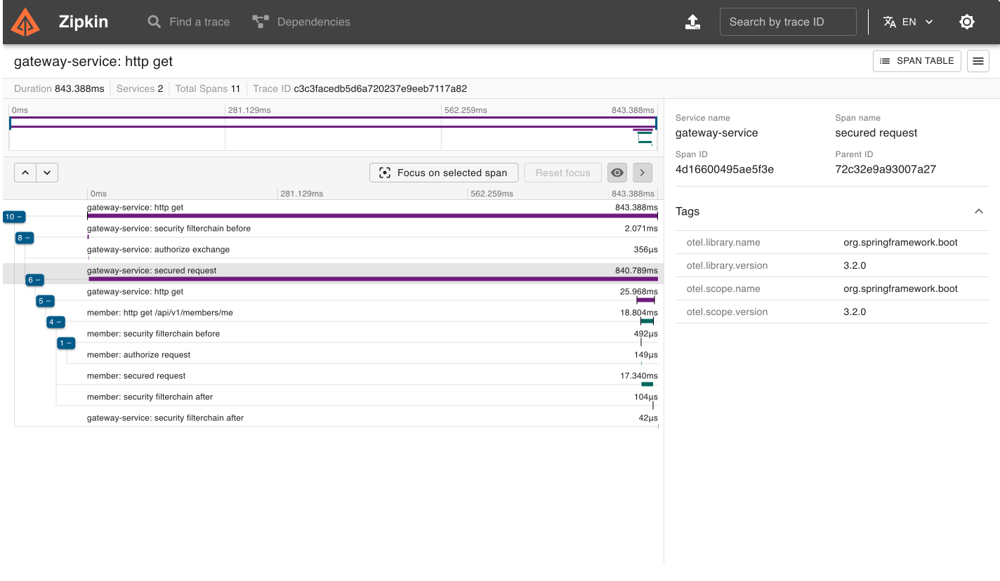
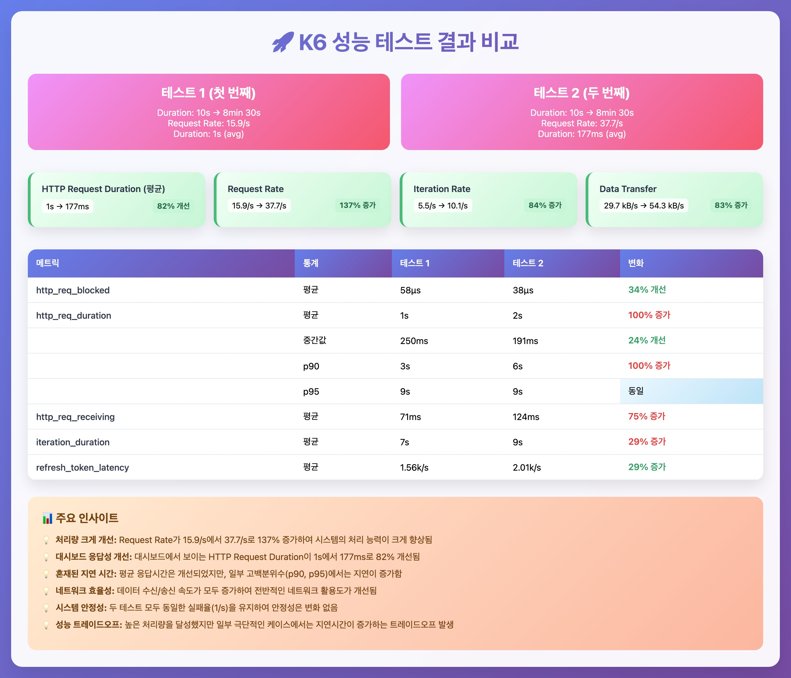
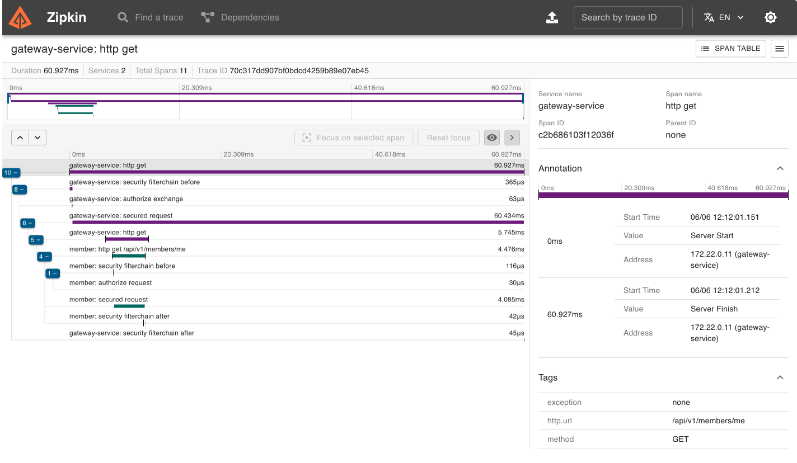

# API Gateway 병목 지점 식별
## 문제 식별
[](zipkin_before.png)
- api gateway에서 secured request에 840.789ms 발생

## 문제 식별 및 개선 방안 수립
### 🔴 문제점 파악
- refresh 토큰 처리과정에서 복잡한 동시성 제어
1. **처리 흐름**
    > 토큰 유효성 체크 -> (만료시) refresh 토큰 처리
2. **복잡한 동시성 제어**
    ```java
    String tokenKey = generateTokenKey(refreshToken);  // 해시 생성
    
    // Step 1: 진행중인 요청 체크
    Mono<TokenResponse> cachedRefresh = refreshingTokens.get(tokenKey);
    if (cachedRefresh != null) {
        return cachedRefresh.flatMap(...);  // 기존 요청 재사용
    }
    
    // Step 2: 토큰별 락 획득 시도
    ReentrantLock lock = tokenLocks.computeIfAbsent(tokenKey, k -> new ReentrantLock());
    boolean locked = lock.tryLock();
    if (!locked) {
        // 락 실패 → 50ms 대기 후 재귀 호출
        return Mono.delay(Duration.ofMillis(50))
            .then(refreshTokenAndContinue(exchange, chain, refreshToken));
    }
    
    // Step 3: Double-checked locking
    try {
        cachedRefresh = refreshingTokens.get(tokenKey);
        if (cachedRefresh != null) {
            return cachedRefresh.flatMap(...);
        }
    
        // Step 4: 실제 Auth 서비스 호출
        Mono<TokenResponse> refreshRequest = webClient.post()...;
    
        // Step 5: 진행중인 요청 맵에 추가
        refreshingTokens.put(tokenKey, refreshRequest);
    
        // Step 6: 10초 후 정리 스케줄링
        refreshRequest.doFinally(signal -> {
            Mono.delay(Duration.ofSeconds(10))
                .doOnSuccess(v -> {
                    refreshingTokens.remove(tokenKey);
                    tokenLocks.remove(tokenKey);
                })
                .subscribe();
        }).subscribe();
    
        return refreshRequest.flatMap(...);
    } finally {
        lock.unlock();
    }
    
    ```
3. **문제점**
  - **3개의 동시성 제어 메커니즘** (Map + Lock + 재귀)
  - **메모리 누수 위험** (Lock 객체 무한 생성)
  - **복잡한 생명주기 관리** (10초 후 정리)
  - **재귀 호출** (스택 오버플로우 위험)
  - **단일 서버 내에서만 동작** (여러 Gateway 인스턴스 간 공유 불가)

### 🟢 개선방안
- redis 캐싱을 적용하여 개선

1. **처리 흐름**
    > 토큰 유효성 체크 -> (만료시) refresh 토큰 처리

2. **Redis 기반 캐시 확인**
    
    ```java
    public Mono<TokenResponse> getOrRefreshToken(String refreshToken) {
        String cacheKey = "refresh_token:" + hashToken(refreshToken);
        String lockKey = "refresh_lock:" + hashToken(refreshToken);
    
        // Step 1: Redis 캐시에서 확인
        return redisTemplate.opsForValue().get(cacheKey)
            .cast(TokenResponse.class)
            .switchIfEmpty(
                // Step 2: 캐시 미스 → 분산 락 시도
                acquireDistributedLock(lockKey)
                    .flatMap(lockAcquired -> {
                        if (lockAcquired) {
                            // Step 3: Auth 서비스 호출
                            return refreshTokenFromAuth(refreshToken)
                                .doOnSuccess(tokenResponse ->
                                    // Step 4: 결과를 Redis에 캐시 (1분 TTL)
                                    cacheTokenResponse(cacheKey, tokenResponse).subscribe())
                                .doFinally(signal ->
                                    // Step 5: 락 자동 해제 (Redis TTL)
                                    releaseLock(lockKey).subscribe());
                        } else {
                            // 락 실패 → 50ms 대기 후 재시도
                            return Mono.delay(Duration.ofMillis(50))
                                .then(getOrRefreshToken(refreshToken));
                        }
                    })
            );
    }
    
    ```
3. **Redis 분산 락**
    
    ```java
    private Mono<Boolean> acquireDistributedLock(String lockKey) {
        // SET lockKey "locked" NX EX 10 (원자적 연산)
        return redisTemplate.opsForValue()
            .setIfAbsent(lockKey, "locked", Duration.ofSeconds(10));
    }
    
    ```
4. **개선점**
- **단순한 로직** (Redis 원자적 연산 활용)
- **자동 메모리 관리** (Redis TTL)
- **분산 환경 지원** (여러 Gateway 인스턴스 간 공유)
- **예측 가능한 성능** (Redis 응답 시간 일정)

### 🔄 핵심 차이점
- 차이점
    | 구분 | 기존 방식 | Redis 방식 |
    |------|-----------|------------|
    | 캐싱 위치 | JVM 내 In-Memory (ConcurrentHashMap) | 외부 분산 캐시 |
    | 동시성 제어 | ReentrantLock + Double-checked locking | SET NX EX (원자적 분산 락) |
    | 생명주기 관리 | 복잡한 스케줄링 (Mono.delay + subscribe) | TTL 자동 만료 |
    | 확장성 | 단일 서버만 지원 | 다중 서버 지원 |
    | 장애 처리 | 메모리 누수 위험 | TTL로 자동 정리 |

## 📊 K6 성능테스트
### 테스트 조건
- 테스트 상세
    | 구분 | 내용 |
    |------|------|
    | **테스트 단계** | 1. 워밍업 (1분, 1 VU)<br>2. 소규모 (2분, 10 VU)<br>3. 중간 규모 (2분, 50 VU)<br>4. 대규모 (2분, 100 VU)<br>5. 쿨다운 (1분, 0 VU) |
    | **테스트 계정** | - 총 100개 테스트 계정 생성<br>- VU별로 다른 계정 사용 (라운드 로빈 방식) |
    | **테스트 시나리오** | 1. 만료된 Access Token으로 API 호출 (Refresh 필요)<br>2. 동일한 Refresh Token으로 연속 3회 호출 (캐시 테스트) |
    | **측정 지표** | 1. Refresh Token 처리 응답시간<br>2. Auth 서비스 호출 횟수<br>3. 캐시 히트율 (Redis 테스트시)<br>4. 동시 사용자별 성능 변화<br>5. 실제 로그인 성공률 |
    | **성능 기준** | - 복잡한 락: P95 < 2000ms<br>- Redis 캐싱: P95 < 2000ms<br>- |
    | **실패 기준** | - 복잡한 락: 실패율 < 5%<br>- Redis 캐싱: 실패율 < 1%<br>- |

### 성능 결과
[](k6_result.JPG)

- K6 대시보드(HTML) - Redis 적용 결과
[👉 Redis Load Test Dashboard 보기](api_gateway/redis_load_result.html)

- K6 대시보드(HTML) - Memory Lock 결과
[👉 Memory Lock Test Dashboard 보기](api_gateway/memory-lock-result.html)

## ✅ 개선 방안 선정
- redis 캐싱 방식으로 api gate 수정

### 🥊 서버 적용 및 배포
[](zipkin_after.png)
- 결과
    | 구분                | 개선 전   | 개선 후  | 개선율         |
    |---------------------|----------|---------|----------------|
    | 전체 응답시간       | 843ms    | 61ms    | 🔥 92.8% 단축  |
    | Gateway 처리시간    | 840ms    | 60ms    | 92.9% 단축     |
    | Member 서비스       | 18ms     | 4ms     | 77.8% 단축     |
    | Gateway→Member 호출 | 25ms     | 5.7ms   | 77.2% 단축     |
