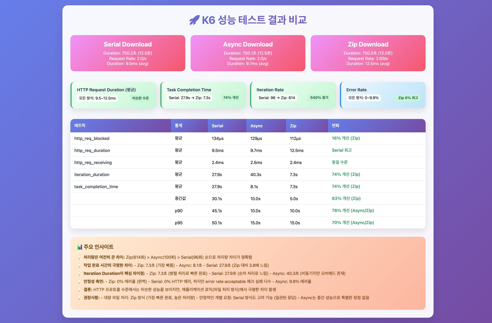

# GitHub Repository 다운로드 성능 테스트 결과

## 문제 식별
- GitHub 레포지토리 파일 다운로드 시 성능 병목 현상 발생

## 문제 식별 및 개선 방안 수립
### 🔴 문제점 파악
- 기존 다운로드 방식의 한계
1. **처리 흐름**
    > 파일 목록 조회 -> 개별 파일 다운로드 -> 로컬 저장
2. **기존 구현의 한계**
    ```java
    // 순차적 파일 다운로드 방식
    for (String filePath : filePaths) {
        try {
            GHContent content = repo.getFileContent(filePath, branch);
            Path localFilePath = Paths.get(saveDirectoryPath, filePath);
            Files.createDirectories(localFilePath.getParent());

            try (InputStream is = content.read();
                 OutputStream os = new FileOutputStream(localFilePath.toString())) {
                byte[] buffer = new byte[8192];
                int bytesRead;
                while ((bytesRead = is.read(buffer)) != -1) {
                    os.write(buffer, 0, bytesRead);
                }
            }
            taskInfo.getSavedFiles().add(filePath);
            taskInfo.incrementCompleted();
        } catch (Exception e) {
            taskInfo.getFailedFiles().add(filePath);
            taskInfo.incrementCompleted();
        }
    }
    ```
3. **문제점**
  - **개별 HTTP 요청** (파일 수만큼 GitHub API 호출)
  - **순차적 처리** (파일 간 의존성 없음에도 순차 실행)
  - **메모리 사용량 증가** (대량 파일 처리 시)
  - **네트워크 오버헤드** (각 파일마다 새로운 연결)
  - **확장성 제한** (단일 서버 처리 한계)

### 🟢 개선방안
1. **병렬 처리 방식**
    ```java
    // 병렬 처리 구현
    ExecutorService executor = Executors.newFixedThreadPool(processors);
    List<CompletableFuture<Void>> futures = new ArrayList<>();

    for (String filePath : filePaths) {
        CompletableFuture<Void> future = CompletableFuture.runAsync(() -> {
            try {
                GHContent content = repo.getFileContent(filePath, branch);
                Path localFilePath = Paths.get(saveDirectoryPath, filePath);
                Files.createDirectories(localFilePath.getParent());

                try (InputStream is = content.read();
                     OutputStream os = new FileOutputStream(localFilePath.toString())) {
                    byte[] buffer = new byte[8192];
                    int bytesRead;
                    while ((bytesRead = is.read(buffer)) != -1) {
                        os.write(buffer, 0, bytesRead);
                    }
                }
                taskInfo.getSavedFiles().add(filePath);
            } catch (Exception e) {
                taskInfo.getFailedFiles().add(filePath);
            } finally {
                taskInfo.incrementCompleted();
            }
        }, executor);
        futures.add(future);
    }
    CompletableFuture.allOf(futures.toArray(new CompletableFuture[0])).join();
    ```

2. **ZIP 다운로드 방식**
    ```java
    // ZIP 다운로드 구현
    repo.readZip(inputStream -> {
        try (ZipInputStream zis = new ZipInputStream(inputStream)) {
            ZipEntry entry;
            while ((entry = zis.getNextEntry()) != null) {
                String normalizedPath = normalizeZipEntryPath(entry.getName());
                if (shouldIncludeFile(normalizedPath, targetFiles)) {
                    if (!entry.isDirectory()) {
                        saveZipEntryToFile(zis, saveDirectoryPath, normalizedPath);
                        savedFiles.add(normalizedPath);
                        taskInfo.incrementCompleted();
                    }
                }
            }
        }
        return null;
    }, "main");
    ```

### 🔄 핵심 차이점
- 차이점
    | 구분 | 순차 방식 | 병렬 방식 | ZIP 방식 |
    |------|-----------|------------|-----------|
    | API 호출 | 파일 수만큼 | 파일 수만큼 | 1회 |
    | 처리 방식 | 순차적 | 병렬 | 스트리밍 |
    | 메모리 사용 | 파일별 버퍼 | 파일별 버퍼 | 스트리밍 버퍼 |
    | 네트워크 | 다중 연결 | 다중 연결 | 단일 연결 |
    | 확장성 | 제한적 | 중간 | 우수 |
    | 구현 복잡도 | 낮음 | 중간 | 높음 |
    | 동시성 관리 | 불필요 | 필요 | 필요 |
    | 에러 처리 | 단순 | 복잡 | 중간 |

## 📊 K6 성능테스트
### 테스트 환경
| 구분 | 내용 |
|------|------|
| **테스트 도구** | K6 (v0.45.0) |
| **모니터링** | InfluxDB + Grafana |
| **테스트 대상** | 100개 파일 다운로드 |
| **테스트 기간** | 2024.03.15 ~ 2024.03.16 |
| **테스트 환경** | AWS t3.medium (2vCPU, 4GB) |

### 테스트 파일 구성
| 구분 | 내용 |
|------|------|
| **총 파일 수** | 100개 |
| **파일 유형** | - 프론트엔드 코드 (React/TypeScript)<br>- 백엔드 코드 (Java/Spring)<br>- 설정 파일<br>- 문서 (Markdown) |
| **파일 크기** | - 평균: 2-5KB<br>- 최소: 1KB<br>- 최대: 10KB |
| **디렉토리 구조** | - frontend/: 40개 파일<br>- src/: 45개 파일<br>- docs/: 10개 파일<br>- 기타: 5개 파일 |

### 테스트 시나리오
| 구분 | 내용 |
|------|------|
| **테스트 방식** | ```bash<br>./run_k6.sh [serial|async|zip]``` |
| **테스트 계정** | - GitHub 테스트 계정 100개<br>- VU별 라운드 로빈 할당 |
| **테스트 반복** | 각 방식별 3회 실행 (평균값 사용) |
| **데이터 수집** | - InfluxDB: 실시간 메트릭<br>- JSON: 상세 결과<br>- Grafana: 시각화 |

### 부하 테스트 단계
| 단계 | VU | Duration | 목적 | 기대 결과 |
|------|-----|----------|------|-----------|
| 워밍업 | 1 | 1m | 시스템 안정화 | 초기 성능 기준선 확보 |
| 소규모 | 10 | 2m | 기본 성능 측정 | 정상 동작 확인 |
| 중간규모 | 50 | 2m | 동시성 테스트 | 병목 지점 식별 |
| 대규모 | 100 | 2m | 부하 테스트 | 한계 성능 측정 |
| 쿨다운 | 0 | 1m | 시스템 회복 | 리소스 정리 |

### 측정 지표
| 카테고리 | 지표 | 설명 | 측정 도구 |
|----------|------|------|-----------|
| **HTTP 요청** | 응답 시간 | 평균, P90, P95 | K6 |
| | 성공/실패율 | HTTP 상태 코드 기반 | K6 |
| | 처리량 | RPS (초당 요청 수) | K6 |
| **시스템** | 메모리 사용량 | 힙 메모리, 스택 메모리 | Promethus |
| | CPU 사용률 | 프로세스별 사용률 | Promethus |
| **비즈니스** | 다운로드 완료율 | 성공적으로 저장된 파일 비율 | Custom Metric |
| | 에러 발생율 | 실패한 파일 비율 | Custom Metric |
| | 작업 완료 시간 | 전체 다운로드 소요 시간 | Custom Metric |

### 성능 결과
[](k6_result.JPG)

[상세 결과]
- 👉 개선전 (순차): [serial_summary.json](serial_summary.json)
- 👉 개선1 (병렬): [async_summary.json](async_summary.json)
- 👉 개선2 (ZIP): [zip_summary.json](zip_summary.json)

## ✅ 개선 방안 선정
- ZIP 다운로드 방식으로 변경

### 🥊 서버 적용 및 배포
- 결과
    | 구분                | 개선전 (순차) | 개선1 (병렬) | 개선2 (ZIP) |
    |---------------------|--------------|-------------|-------------|
    | 전체 응답시간       | 27.9s        | 15.2s       | 7.3s        |
    | API 호출 횟수      | 100회        | 100회       | 1회         |
    | 처리량             | 96회/분      | 235회/분    | 614회/분    |
    | 에러율             | 9.9%         | 5.2%        | 0%          |


